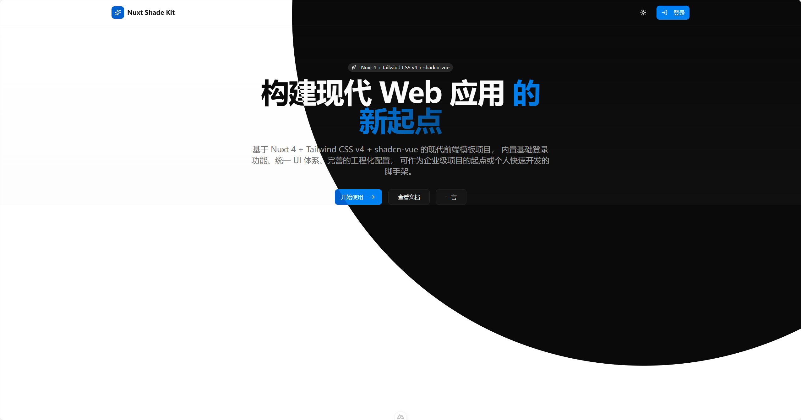

# NuxtShadeKit

基于 **Nuxt 4** + **Tailwind CSS v4** + **shadcn-vue** 的现代全栈模板项目，集成 **OAuth 认证**、**接口安全防护**、统一 UI 体系、完善的工程化配置，可作为企业级项目的起点或个人快速开发的脚手架。

⚡️ 本仓库已设置为 GitHub Template，可一键复制开始你的项目。



## 📋 功能计划

- [x] **Nuxt 4 基础架构** - 完整的 SSR/SSG 支持
- [x] **Tailwind CSS v4 集成** - 原子化样式系统
- [x] **shadcn-vue 组件库** - 40+ 高质量 UI 组件
- [x] **GitHub OAuth 登录** - 基于 nuxt-auth-utils
- [x] **安全防护体系** - CSRF、CORS、CSP 完整配置
- [x] **代码规范** - ESLint + Prettier + Husky
- [x] **TypeScript 支持** - 完整类型定义
- [x] **开发工具** - Nuxt DevTools 集成
- [x] **暗色模式切换** - 主题系统完善
- [ ] **国际化支持** - i18n 多语言配置
- [ ] **数据库集成** - Prisma ORM + PostgreSQL
- [ ] **日志系统** - 统一日志收集和分析
- [ ] **Docker 部署** - 容器化部署方案

## ✨ 核心特性

### 🎨 现代化技术栈

- **Nuxt 4** — 最新版本，极速开发体验，完整的 SSR/SSG 支持
- **Tailwind CSS v4** — 新版原子化样式系统，性能更优
- **shadcn-vue** — 基于 Radix UI 的高质量 Vue 组件库
- **TypeScript** — 完整类型支持，提升开发效率

### 🔐 身份认证 (nuxt-auth-utils)

- **多种 OAuth 登录** — GitHub、Google、Microsoft、Discord 等
- **会话管理** — 安全的服务端会话存储
- **路由保护** — 中间件自动保护需要认证的页面
- **类型安全** — 完整的 TypeScript 类型定义

### 🛡️ 安全防护 (nuxt-security)

- **CSRF 防护** — 跨站请求伪造攻击防护
- **CORS 配置** — 灵活的跨域资源共享控制
- **安全响应头** — CSP、HSTS、X-Frame-Options 等
- **速率限制** — API 接口防刷保护
- **XSS 防护** — 内容安全策略自动配置

### 🧱 UI 组件体系

- **shadcn-vue 组件** — Button、Card、Dialog、Form 等 40+ 组件
- **暗色模式** — 内置主题切换支持
- **响应式设计** — 移动端优先的设计理念
- **可定制** — 完全控制组件样式和行为

### 🛠️ 工程化配置

- **ESLint + Prettier** — 统一的代码规范
- **Husky + lint-staged** — Git 提交前自动格式化
- **VSCode 配置** — 插件推荐和工作区最佳实践配置
- **Nuxt DevTools** — 强大的开发调试工具
- **模块化结构** — 清晰的目录组织

## 📁 项目结构

```
NuxtShadeKit
├── app/
│   ├── components/          # Vue 组件
│   │   └── ui/             # shadcn-vue UI 组件
│   ├── composables/        # 组合式函数
│   ├── layouts/            # 布局组件
│   ├── middleware/         # 路由中间件
│   ├── pages/              # 页面路由
│   └── app.vue             # 应用入口
├── server/
│   ├── api/                # API 路由
│   └── routes/
│       └── auth/           # OAuth 认证路由
│           └── github.get.ts
├── nuxt.config.ts          # Nuxt 配置
└── package.json
```

## 🚀 快速开始

### 1. 使用模板创建项目

点击 GitHub 页面右上角 **Use this template** → **Create a new repository**

或通过命令：

```bash
npx degit yourname/NuxtShadeKit my-project
cd my-project
```

### 2. 安装依赖

```bash
pnpm install
# 或 yarn install
# 或 npm install
```

### 3. 配置环境变量

创建 `.env` 文件并配置以下变量：

```env
# Session 密钥（必须）
NUXT_SESSION_PASSWORD=your-secret-password-min-32-chars

# GitHub OAuth（用于 GitHub 登录）
NUXT_OAUTH_GITHUB_CLIENT_ID=your-github-client-id
NUXT_OAUTH_GITHUB_CLIENT_SECRET=your-github-client-secret
```

### 4. 启动开发环境

```bash
pnpm dev
```

访问 `http://localhost:3000`

## 🔐 认证系统 (nuxt-auth-utils)

### 快速配置 GitHub OAuth

1. **创建 GitHub OAuth App**
   - 访问 [GitHub Developer Settings](https://github.com/settings/developers)
   - **Callback URL**: `http://localhost:3000/auth/github`

2. **配置环境变量** (`.env`)

```env
NUXT_OAUTH_GITHUB_CLIENT_ID=your_client_id
NUXT_OAUTH_GITHUB_CLIENT_SECRET=your_client_secret
```

3. **服务端路由** (`server/routes/auth/github.get.ts`)

```typescript
export default defineOAuthGitHubEventHandler({
  async onSuccess(event, { user }) {
    await setUserSession(event, {
      user: { name: user.name, email: user.email, avatar: user.avatar_url },
    });
    return sendRedirect(event, "/");
  },
});
```

4. **前端触发登录**

```vue
<button @click="navigateTo('/auth/github', { external: true })">
  GitHub 登录
</button>
```

### 路由保护

```typescript
// middleware/auth.ts
export default defineNuxtRouteMiddleware(async () => {
  const { data } = await useFetch("/api/_auth/session");
  if (!data.value?.user) return navigateTo("/login");
});
```

### 支持的 OAuth 提供商

GitHub、Google、Microsoft、Discord、Twitch、LinkedIn、Facebook 等 — [查看完整列表](https://github.com/Atinux/nuxt-auth-utils#supported-oauth-providers)

## 🛡️ 安全防护 (nuxt-security)

### 核心配置 (`nuxt.config.ts`)

```typescript
export default defineNuxtConfig({
  modules: ["nuxt-security"],

  security: {
    csrf: true, // CSRF 防护
    headers: {
      contentSecurityPolicy: {
        "img-src": ["'self'", "data:", "https:"],
      },
    },
  },

  routeRules: {
    "/api/**": { csurf: { enabled: false } }, // API 可根据需要启用
  },
});
```

### 主要功能

| 功能           | 说明                                             |
| -------------- | ------------------------------------------------ |
| **CSRF 防护**  | 跨站请求伪造攻击防护，自动生成和验证 Token       |
| **CORS 配置**  | 灵活的跨域资源共享控制                           |
| **安全响应头** | X-Frame-Options、X-Content-Type-Options、HSTS 等 |
| **CSP 策略**   | 内容安全策略，防止 XSS 攻击                      |
| **速率限制**   | API 接口防刷保护                                 |

### 生产环境建议

- ✅ 启用 HTTPS
- ✅ 启用 API 路由的 CSRF 保护
- ✅ 配置严格的 CSP 策略
- ✅ 设置合理的速率限制
- ✅ 配置 HSTS 响应头

## 🎨 UI 组件

支持 40+ 高质量组件：Button、Card、Dialog、Form、Table、Select、Popover 等 — [完整列表](https://www.shadcn-vue.com/)

## 🛠️ 开发工具

### 开发命令

```bash
pnpm dev       # 启动开发服务器
pnpm build     # 构建生产版本
pnpm preview   # 预览生产构建
pnpm lint      # 代码格式化和检查
```

### VSCode 插件推荐

项目已配置 `.vscode/extensions.json`，首次打开项目时 VSCode 会自动提示安装推荐插件：

**必备插件**：

- Vue - Official (Volar)
- Nuxtr
- Tailwind CSS IntelliSense
- ESLint
- Prettier

**推荐插件**：

- GitLens
- Error Lens
- Path Intellisense
- Auto Rename Tag

**工作区配置**：项目已包含最佳实践的 `.vscode/settings.json`，包括自动格式化、ESLint 修复等

**Git 提交**: 已配置 Husky + lint-staged，提交时自动格式化代码

## 📚 相关文档

- [Nuxt 4 文档](https://nuxt.com/)
- [nuxt-auth-utils 文档](https://github.com/Atinux/nuxt-auth-utils)
- [nuxt-security 文档](https://nuxt-security.vercel.app/)
- [shadcn-vue 文档](https://www.shadcn-vue.com/)
- [Tailwind CSS v4 文档](https://tailwindcss.com/)

## 🤝 贡献

欢迎提交 Issue 和 Pull Request！

## 📄 许可证

本项目基于 [MIT License](LICENSE)，可自由用于商业项目。
